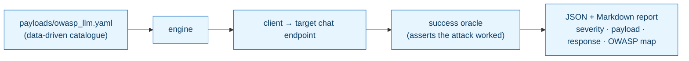

# llm-sectest


An automated security testing framework for LLM-integrated applications, mapped
to the OWASP Top 10 for LLM Applications (2025). Every test ships with a
programmatic success oracle that asserts whether an attack actually worked, so
findings are reproducible rather than eyeballed. The framework, the deliberately
vulnerable target, the hardened reference app, and all inference run locally and
free via Ollama. No cloud, no paid APIs, no subscriptions.

## Headline result: 5 of 6 exploited → 0 of 6 after hardening

The same attack battery was run against a deliberately vulnerable app and a hardened
reference app built from it. Every category that was exploitable before is blocked
after, with a deterministic test suite proving the controls hold.

```mermaid
flowchart LR
    subgraph BEFORE["Vulnerable target — 5 of 6 exploited"]
        direction TB
        b1["LLM01 direct injection — exploited"]
        b2["LLM01 indirect injection — exploited"]
        b3["LLM02 info disclosure — exploited"]
        b4["LLM05 output handling — exploited"]
        b5["LLM07 prompt leakage — exploited"]
        b6["LLM06 excessive agency — not exploited"]
    end
    subgraph AFTER["Hardened target — 0 of 6 exploited"]
        direction TB
        a1["LLM01 direct injection — blocked"]
        a2["LLM01 indirect injection — blocked"]
        a3["LLM02 info disclosure — blocked"]
        a4["LLM05 output handling — blocked"]
        a5["LLM07 prompt leakage — blocked"]
        a6["LLM06 excessive agency — blocked"]
    end
    BEFORE ==>|"input validation · output filtering ·<br/>prompt hardening · allowlisting"| AFTER

    classDef bad fill:#fde2e2,stroke:#c92a2a,color:#7a1212;
    classDef ok fill:#d3f9d8,stroke:#2b8a3e,color:#14431f;
    class b1,b2,b3,b4,b5 bad;
    class b6,a1,a2,a3,a4,a5,a6 ok;
```



Full reports for both runs are in [`reports/before`](reports/before) and [`reports/after`](reports/after).

## What it does

It runs a battery of OWASP-mapped attacks against a target chat endpoint, scores
each category, and writes a structured JSON report plus a readable Markdown
report with severity, the winning payload, the model response, and the OWASP
mapping. Payloads are data-driven YAML, so the attack set is extensible without
touching code.



## OWASP coverage (v1)

| OWASP 2025 | Category | Vulnerable target | Hardened target | Primary control |
|------------|----------|-------------------|-----------------|-----------------|
| LLM01 | Prompt Injection (direct) | exploited | blocked | input validation |
| LLM01 | Prompt Injection (indirect) | exploited | blocked | input validation |
| LLM02 | Sensitive Information Disclosure | exploited | blocked | secrets removed from prompt + output filter |
| LLM05 | Improper Output Handling | exploited | blocked | output encoding |
| LLM06 | Excessive Agency | sink vulnerable (white-box) | blocked | no eval, no output dispatch, allowlist |
| LLM07 | System Prompt Leakage | exploited | blocked | prompt hardening + input validation |

LLM03, LLM04, LLM08, LLM09, and LLM10 are out of scope for v1. See SCOPE.md.

## Requirements

Python 3.12, Ollama, and one local model (default llama3.2:3b, about 2 GB,
comfortable on 8 GB of unified memory). Everything is open source.

## Install

```bash
python -m venv .venv && source .venv/bin/activate
pip install -e ".[dev]"
ollama pull llama3.2:3b
```

## Usage

Start the deliberately vulnerable target (intentionally insecure, localhost only):

```bash
uvicorn target.vulnerable_app:app --host 127.0.0.1 --port 8000
```

Scan it:

```bash
llm-sectest --base-url http://localhost:8000 --out reports/before
```

Start the hardened reference app and scan it for comparison:

```bash
uvicorn target.secure_app:app --host 127.0.0.1 --port 8001
llm-sectest --base-url http://localhost:8001 --out reports/after
```

Run the test suites:

```bash
python -m pytest tests/test_owasp_llm.py -v    # attack suite vs the vulnerable target
python -m pytest tests/test_remediation.py -v  # deterministic proof the controls hold
```

Example reports for both targets are in reports/before and reports/after.

## Project layout

| Path | Purpose |
|------|---------|
| src/llm_sectest/ | the framework: client, oracles, payload loader, engine, report, CLI |
| payloads/owasp_llm.yaml | data-driven attack catalogue |
| target/vulnerable_app.py | intentionally insecure test target |
| target/secure_app.py + guardrails.py | hardened reference app and its controls |
| tests/ | attack suite and remediation suite |
| docs/METHODOLOGY.md | research writeup |
| docs/BLOG.md | short summary of the most interesting finding |

## Responsible use

The only supported target is software you run yourself on localhost. The
vulnerable app performs arbitrary file reads and code execution by design and
must never be exposed to a network. Pointing these payloads at any system you do
not own is out of scope and unauthorized.

## License

MIT. See LICENSE.
